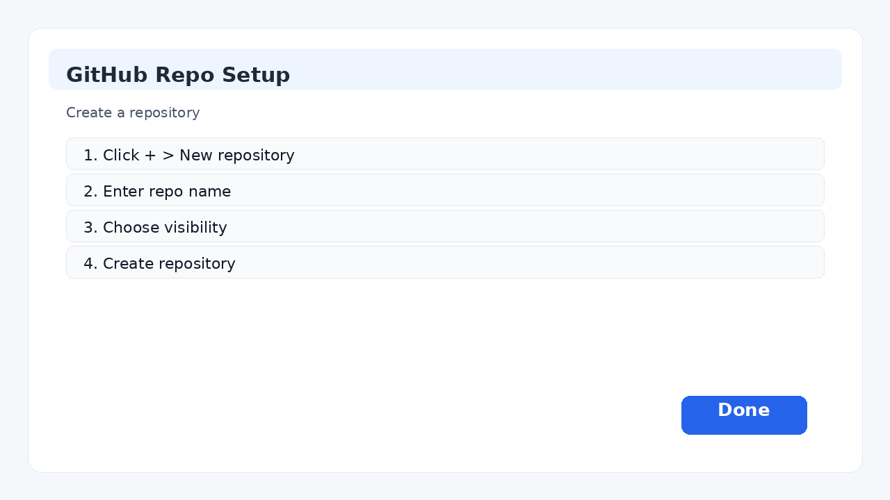
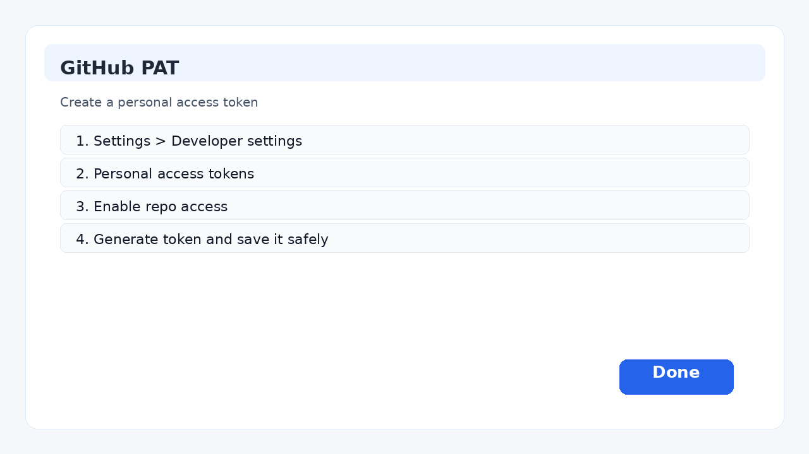
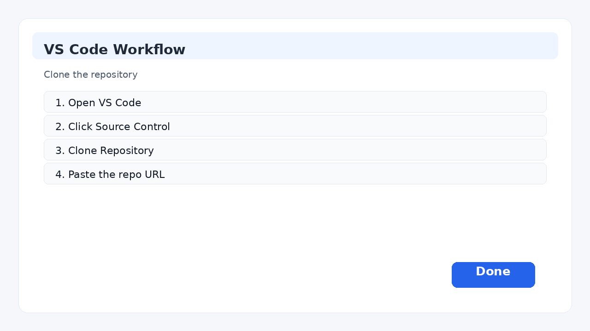
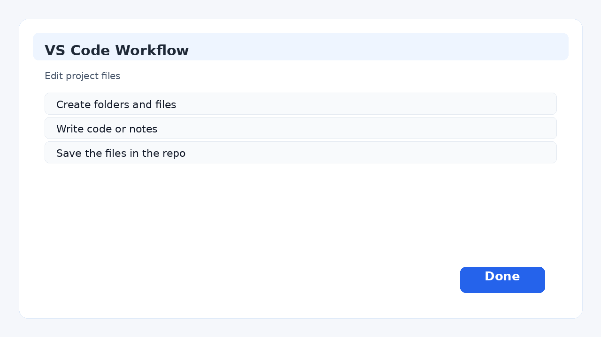
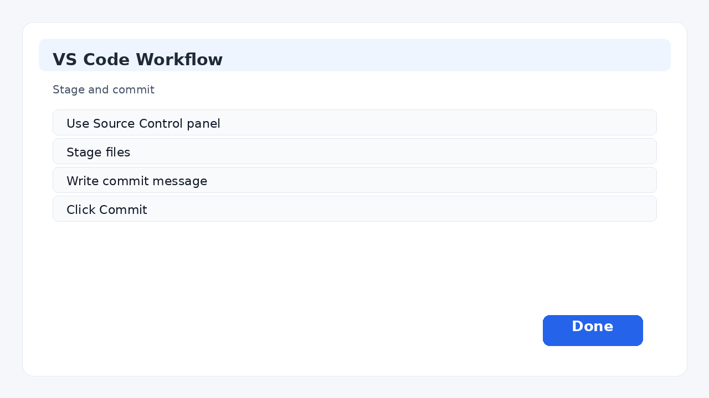
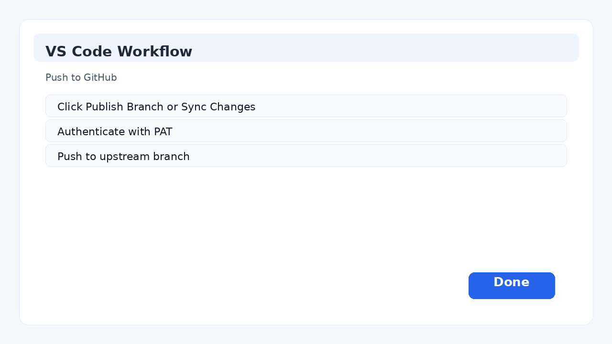

# Hands-On Git Tutorial (VS Code)

This tutorial shows how to create a repository, clone it, make changes in VS Code, create a PAT, commit, and push your changes using the editor interface.

## 1) Create a repository on GitHub

1. Go to GitHub.
2. Click the `+` icon and choose `New repository`.
3. Enter a repository name, such as:
   - `my-vscode-repo`
4. Choose a visibility:
   - Public or Private
5. Leave README unchecked if you want an empty repo.
6. Click `Create repository`.



---

## 2) Create a PAT (Personal Access Token)

A PAT is needed for HTTPS-based Git operations if GitHub is prompting for credentials.

1. Open GitHub.
2. Go to `Settings` -> `Developer settings` -> `Personal access tokens`.
3. Choose `Fine-grained` or `Classic`.
4. Set the token name, expiration, and repository access.
5. Enable at least:
   - `Contents: Read and write`
   - `Metadata: Read`
6. Click `Generate token`.
7. Copy it and store it somewhere safe.



---

## 3) Clone the repo in VS Code

1. Open VS Code.
2. Click the `Source Control` button in the left sidebar.
3. Click `Clone Repository`.
4. Paste the repository URL:
   - `https://github.com/YOUR-USERNAME/my-vscode-repo.git`
5. Choose a local folder for the project.
6. Click `Open` when prompted.

If Git asks for credentials:
- Username: your GitHub username
- Password: your PAT



---

## 4) Create files and folders inside the repo

Inside the Explorer panel:

1. Right-click in the project folder.
2. Choose `New Folder`.
3. Name it something like `docs`.
4. Right-click inside `docs` and choose `New File`.
5. Create a file such as `notes.md`.
6. Add content:

```md
# Project Notes

This file was created in VS Code.
```

You can also create a root-level `README.md` file.



---

## 5) Make changes to files

Open the file in the editor and update the text.

Example:

```md
# Project Notes

This file was created in VS Code.

I am making my first Git change.
```

Once saved, VS Code will show a change in the Source Control panel.

---

## 6) View Git changes in VS Code

1. Click the `Source Control` icon.
2. Review the changed files.
3. You will see:
   - modified files
   - untracked files
   - staged changes

This is the same concept as `git status` in the terminal.

---

## 7) Stage and commit changes

1. Click the `+` button next to the file to stage it.
2. Or use `Stage All Changes`.
3. Enter a commit message such as:
   - `Add project notes`
4. Click `Commit`.

You can also use the command palette:

- `Git: Commit`



---

## 8) Push changes to GitHub

After committing:

1. Click `Publish Branch` or `Sync Changes` in the Source Control area.
2. If prompted, choose the remote repository.
3. If GitHub asks for credentials, use:
   - username: your GitHub username
   - password: your PAT
4. VS Code will push the branch to GitHub.



---

## 9) Continue working normally

The usual flow in VS Code is:

1. Edit files
2. Save changes
3. Stage files
4. Commit changes
5. Push to GitHub

Example:

```bash
git status
git add .
git commit -m "Update project files"
git push origin main
```

---

## 10) Useful tips

### If VS Code keeps asking for a password

Use a PAT instead of your account password.

### If the repo is not visible in Source Control

Open the correct folder in VS Code and ensure it is initialized as a Git repository.

### If the remote is missing

Run this in the terminal:

```bash
git remote -v
```

If needed:

```bash
git remote add origin https://github.com/YOUR-USERNAME/my-vscode-repo.git
```

---

## 11) Working with multiple users, feature branches, and merge conflicts

When multiple people work on the same repository, a strong pattern is to create separate feature branches instead of committing everything directly to the shared development branch.

### Create a feature branch

1. Open the terminal in VS Code.
2. Make sure you are on the development branch:

```bash
git checkout development
git pull origin development
```

3. Create a new branch:

```bash
git checkout -b feature/login-page
```

4. Push it to GitHub:

```bash
git push -u origin feature/login-page
```

### Make changes on the feature branch

1. Edit files inside the project.
2. Save the files.
3. Stage them using the Source Control UI.
4. Commit the snapshot with a message such as:
   - `Add login page UI`
5. Push the branch to GitHub.

### Get the latest changes from development

If another teammate has updated the shared development branch, sync it before finishing your feature:

```bash
git fetch origin
git merge origin/development
```

You can also do this inside VS Code using the integrated Git UI if you prefer.

### Resolve merge conflicts

If Git reports conflicts, VS Code often highlights the conflict markers in the editor.

Look for text like this:

```text
<<<<<<< HEAD
...your version...
=======
...development version...
>>>>>>> origin/development
```

Resolve by:

1. Opening the file
2. Editing the conflict markers
3. Keeping the correct final content
4. Saving the file
5. Staging the file

Then complete the merge:

```bash
git add <file-name>
git commit -m "Resolve merge conflict with development"
```

### Push your fixed feature branch

```bash
git push origin feature/login-page
```

### Merge the feature into development

Once the feature is ready:

```bash
git checkout development
git pull origin development
git merge feature/login-page
git push origin development
```

On GitHub, this is often done through a Pull Request before merging.

### Same feature branch, multiple developers

Sometimes two developers share the same feature branch. In that case, before pushing, each developer must pull the branch, update from development, and resolve conflicts early.

Recommended pattern:

```bash
git checkout feature/login-page
git pull origin feature/login-page
git fetch origin
git merge origin/development
```

Then make updates, save files, stage them, and commit:

```bash
git add .
git commit -m "Continue login page work"
```

Before pushing, check if someone else has updated the same branch:

```bash
git pull --rebase origin feature/login-page
```

If conflicts appear, fix them in the editor, stage the resolved files, and continue the rebase:

```bash
git add <resolved-file>
git rebase --continue
```

When the rebase is complete, push:

```bash
git push origin feature/login-page
```

> This helps avoid overwriting someone else’s work on the same feature branch.

### Team workflow example

```bash
git checkout development
git pull origin development
git checkout -b feature/api-update
git add .
git commit -m "Add API updates"
git push -u origin feature/api-update
git fetch origin
git merge origin/development
git pull --rebase origin feature/api-update
# resolve conflicts if needed
git push origin feature/api-update
```

This keeps feature work synchronized while allowing the team to stay up to date with the latest shared code.

---

## Quick summary

The Git workflow in VS Code is:

1. Create repository on GitHub
2. Clone it in VS Code
3. Create/edit files
4. Stage files
5. Commit changes
6. Push to GitHub

For a team project, use feature branches, pull the latest development branch regularly, resolve conflicts carefully, and merge the finished feature back into development.
